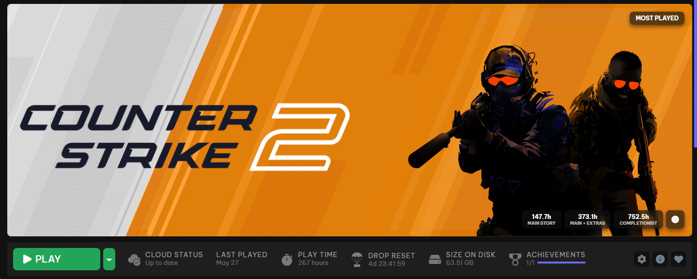
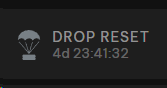
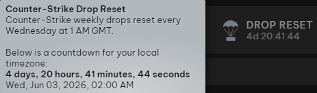

# CS Weekly Drop Reset

A [Millennium](https://github.com/SteamClientHomebrew/Millennium) plugin that adds a live
countdown to the next **Counter-Strike weekly drop reset**, right on the Counter-Strike 2 page in
your Steam library. It mounts a native-looking tile into the play bar's stats row, so it blends in
with Steam's own UI.



The countdown tile in the play bar:



Hover over the tile to see the exact time in your local timezone:



## Features

- **Live countdown** to the next weekly drop reset, updated every second.
- **Native styling** — reuses Steam's own play-bar classes so the tile looks built-in.
- **Hover tooltip** with the reset schedule and the exact reset time in your local timezone.
- **Click through** to a detailed drop-reset info page.
- **Lightweight & frontend-only** — no backend, no network calls, no telemetry.

## Drop reset schedule

Counter-Strike weekly drops reset every **Wednesday at 01:00 UTC**. The tile shows the remaining
time as `Dd HH:MM:SS` (the day count is omitted in the final 24 hours), and the tooltip translates
the next reset into your local time.

## Installation

The easiest way to install is through the Millennium plugin browser:

1. Install [Millennium](https://steambrew.app/).
2. Open Steam → **Millennium** → **Plugins**.
3. Find **CS Weekly Drop Reset** and install it.

Or browse it on the web at [steambrew.app/plugins](https://steambrew.app/plugins).

## Building from source

Requires [Node.js](https://nodejs.org/) and a Millennium-enabled Steam install.

```bash
git clone https://github.com/spix18/cs-weekly-drop
cd cs-weekly-drop
pnpm install      # or: npm install
pnpm run build    # production build -> .millennium/Dist
```

For local development, symlink (or copy) the plugin folder into your Millennium plugins directory
and enable it from the Plugins tab:

- **Windows:** `%STEAM%\plugins\` (e.g. `C:\Program Files (x86)\Steam\plugins\`)
- **Linux:** `~/.local/share/millennium/plugins/`

Use `pnpm run dev` for an unminified development build. To see verbose logs, set `VERBOSE = true` in
`frontend/log.ts`.

## Localisation & Languages

The plugin respects your Steam client language settings. It fully translates all titles, labels, countdown units (day/hour/minute/second), and date formats for the following **10 languages**:

- English (default)
- Chinese (Simplified & Traditional)
- Russian
- German
- Spanish
- French
- Japanese
- Korean
- Portuguese (Brazilian)

## How it works

Steam's library uses an in-memory React router, so the URL never reflects the current page. The
plugin watches each Steam window (via `AddWindowCreateHook`) and detects the Counter-Strike 2 page
by locating the visible play-bar game-name element, then mounts a React tile into that page's stats
section. Navigation is tracked through `history` hooks, `popstate`/`hashchange`, a debounced
`MutationObserver`, and a 1-second polling fallback. Tiles are unmounted cleanly when you leave the
CS2 page.

## Support

If you find this useful, you can support development at [ko-fi.com/spix18](https://ko-fi.com/spix18).

## License

[MIT](LICENSE) © spix
